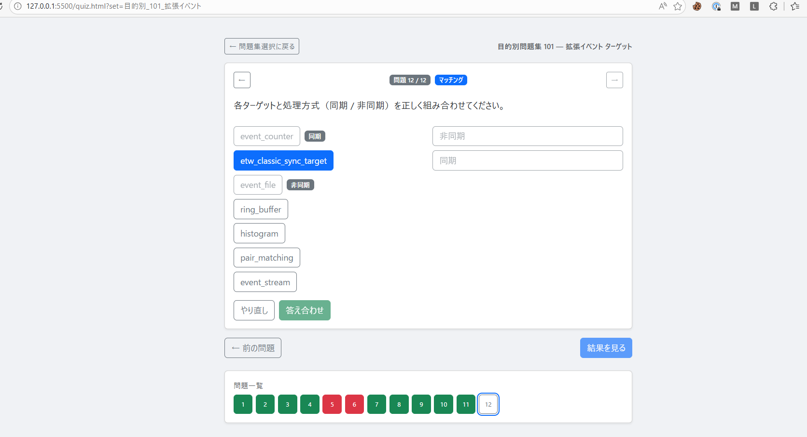

問題集
目的別_101_拡張イベント

問題数
12

バグの内容
左側の選択肢は7つだが、右側の選択肢が2つ。同じ物を選ぶ事ができないので、問題の解答が行えない。
バグの画像



# 対処の案

## 案A: 右列ボタンを再利用可能にする（選択方法の改善）

**概要**  
右列ボタンは現在「一度選んだら disabled」になる設計。これを「何度でも選べる」に変更する。

**変更箇所**  
`quiz.html` の `updateMatchingView` 関数内で、確定済み右インデックスを disabled にしている数行を削除する。

**メリット**
- 実装コストが最も低い（数行の変更）
- 現在の左→右クリックの操作感を維持できる

**デメリット**
- 「この右項目はもう使った」という視覚的フィードバックがなくなる
- 多対一（同期/非同期など）の問題でのみ有効な対処

---

## 案B: 右列をドロップダウン（select要素）に変える（他の出力方式）

**概要**  
右列のボタン群をなくし、左列の各行の右隣にドロップダウン（`<select>`）を配置する。ユーザーは各行のドロップダウンから対応する右項目を選ぶ。

```
event_counter        [（選択してください） ▼]
etw_classic_sync_target [（選択してください） ▼]
event_file           [（選択してください） ▼]
...
```

**変更箇所**  
`quiz.html` のマッチング描画・イベント処理を全面変更。

**メリット**
- 多対一（同一の右項目を複数の左項目に割り当てる）が自然に動く
- スマホでも操作しやすい
- 左→右の「2回クリック」が不要になり操作がシンプルになる

**デメリット**
- 実装コストが中程度（描画・イベント・採点・復元処理を変更）

---

## 案C: JSONの問題設計を変える（問題12を multiple 問題に変更）

**概要**  
問題12を `matching` タイプから `multiple` タイプに変更する。  
「同期で処理されるターゲットを2つ選んでください」という形式にする。

**変更箇所**  
`data/目的別_101_拡張イベント.json` の問題12のみ。コードの変更なし。

```json
{
  "id": 12,
  "type": "multiple",
  "answer_count": 2,
  "question": "拡張イベントのターゲットのうち、同期で処理されるものを2つ選んでください。",
  ...
}
```

**メリット**
- コードの変更が不要
- 既存の `multiple` 問題として正確に動く
- 「同期か非同期か」を問う問題として本質的に適切な形式

**デメリット**
- matching 形式ではなくなる（7つ全部の対応を確認する問題にはならない）

---

## 推奨

**短期**: 案C（JSONのみ変更、コスト最小）  
**長期**: 案B（ドロップダウン方式）を実装し、多対一のマッチング問題を正しく扱えるようにする