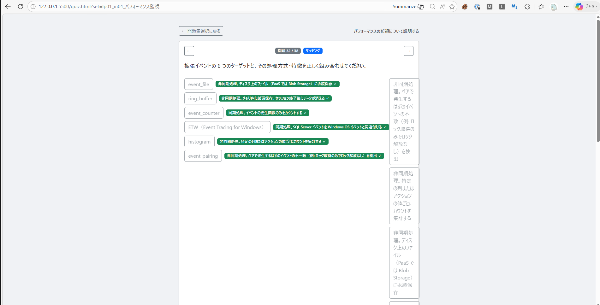
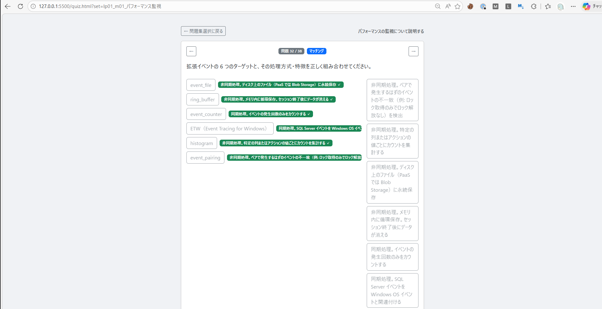
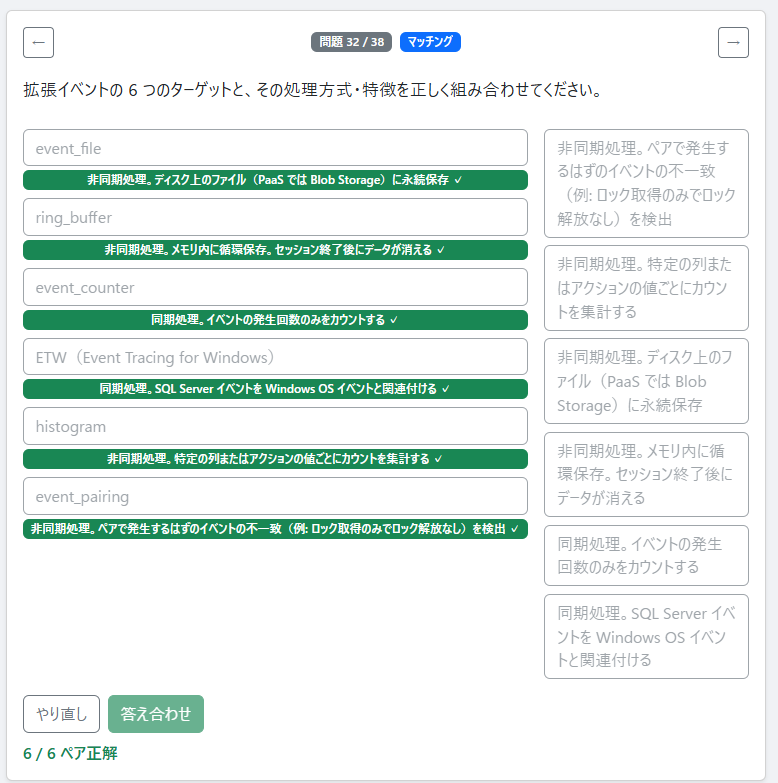

問題集 : パフォーマンスの監視について説明する

問題番号 32/38

バグの内容: 
マッチング問題で左側の選択肢を選んだ時、横幅が広くなりすぎて右側の選択肢が狭くなってしまう。
# 画像と説明
## 修正前

## 修正1回目後

```html
<div class="card shadow-sm mb-3">
    <div class="card-body">

        <!-- 問題番号・選択形式・上部ナビ -->
        <div class="d-flex align-items-center justify-content-between mb-3">
            <button id="btn-prev-top" class="btn btn-sm btn-outline-secondary" aria-label="前の問題">←</button>
            <div id="question-badge-group" class="d-flex align-items-center gap-2" aria-label="問題 32 / 38、マッチング">
                <span id="question-index" class="badge bg-secondary" aria-hidden="true">問題 32 / 38</span>
                <span id="question-type-badge" class="badge bg-primary" aria-hidden="true">マッチング</span>
            </div>
            <button id="btn-next-top" class="btn btn-sm btn-outline-secondary" aria-label="次の問題">→</button>
        </div>

        <!-- 問題文 -->
        <div id="question-text" class="question-text mb-4">拡張イベントの 6 つのターゲットと、その処理方式・特徴を正しく組み合わせてください。</div>

        <!-- 選択肢（single / multiple 用） -->
        <div id="choices" class="d-grid gap-2 d-none"><button class="btn choice-btn btn-outline-secondary"
                data-label="A" disabled="">A. Azure Log Analytics</button><button class="btn choice-btn btn-success"
                data-label="B" disabled="">B. Azure Monitor</button><button class="btn choice-btn btn-danger"
                data-label="C" disabled="">C. SQL リソース プロバイダー</button><button
                class="btn choice-btn btn-outline-secondary" data-label="D" disabled="">D. Windows パフォーマンス
                モニター（PerfMon）</button></div>

        <!-- マッチング問題用 -->
        <div id="matching-area" class="">
            <div class="matching-columns">
                <div id="matching-left" class="matching-col">
                    <div class="matching-left-row"><button class="btn choice-btn btn-outline-secondary"
                            data-left-idx="0" disabled="">event_file</button>
                        <div class="matching-badge-wrap"><span class="badge bg-success">非同期処理。ディスク上のファイル（PaaS では Blob
                                Storage）に永続保存 ✓</span></div>
                    </div>
                    <div class="matching-left-row"><button class="btn choice-btn btn-outline-secondary"
                            data-left-idx="1" disabled="">ring_buffer</button>
                        <div class="matching-badge-wrap"><span class="badge bg-success">非同期処理。メモリ内に循環保存。セッション終了後にデータが消える
                                ✓</span></div>
                    </div>
                    <div class="matching-left-row"><button class="btn choice-btn btn-outline-secondary"
                            data-left-idx="2" disabled="">event_counter</button>
                        <div class="matching-badge-wrap"><span class="badge bg-success">同期処理。イベントの発生回数のみをカウントする ✓</span>
                        </div>
                    </div>
                    <div class="matching-left-row"><button class="btn choice-btn btn-outline-secondary"
                            data-left-idx="3" disabled="">ETW（Event Tracing for Windows）</button>
                        <div class="matching-badge-wrap"><span class="badge bg-success">同期処理。SQL Server イベントを Windows OS
                                イベントと関連付ける ✓</span></div>
                    </div>
                    <div class="matching-left-row"><button class="btn choice-btn btn-outline-secondary"
                            data-left-idx="4" disabled="">histogram</button>
                        <div class="matching-badge-wrap"><span class="badge bg-success">非同期処理。特定の列またはアクションの値ごとにカウントを集計する
                                ✓</span></div>
                    </div>
                    <div class="matching-left-row"><button class="btn choice-btn btn-outline-secondary"
                            data-left-idx="5" disabled="">event_pairing</button>
                        <div class="matching-badge-wrap"><span class="badge bg-success">非同期処理。ペアで発生するはずのイベントの不一致（例:
                                ロック取得のみでロック解放なし）を検出 ✓</span></div>
                    </div>
                </div>
                <div id="matching-right" class="matching-col"><button class="btn choice-btn btn-outline-secondary"
                        data-right-idx="0" disabled="">非同期処理。ペアで発生するはずのイベントの不一致（例: ロック取得のみでロック解放なし）を検出</button><button
                        class="btn choice-btn btn-outline-secondary" data-right-idx="1"
                        disabled="">非同期処理。特定の列またはアクションの値ごとにカウントを集計する</button><button
                        class="btn choice-btn btn-outline-secondary" data-right-idx="2"
                        disabled="">非同期処理。ディスク上のファイル（PaaS では Blob Storage）に永続保存</button><button
                        class="btn choice-btn btn-outline-secondary" data-right-idx="3"
                        disabled="">非同期処理。メモリ内に循環保存。セッション終了後にデータが消える</button><button
                        class="btn choice-btn btn-outline-secondary" data-right-idx="4"
                        disabled="">同期処理。イベントの発生回数のみをカウントする</button><button class="btn choice-btn btn-outline-secondary"
                        data-right-idx="5" disabled="">同期処理。SQL Server イベントを Windows OS イベントと関連付ける</button></div>
            </div>
            <div class="d-flex gap-2 mt-3">
                <button id="btn-matching-reset" class="btn btn-outline-secondary">やり直し</button>
                <button id="btn-matching-grade" class="btn btn-success" disabled="">答え合わせ</button>
            </div>
            <div id="matching-score" class="mt-2 fw-bold text-success" aria-live="assertive">6 / 6 ペア正解</div>
        </div>

    </div>
</div>
```
## 修正2回目

```html
<div class="card shadow-sm mb-3">
    <div class="card-body">

        <!-- 問題番号・選択形式・上部ナビ -->
        <div class="d-flex align-items-center justify-content-between mb-3">
            <button id="btn-prev-top" class="btn btn-sm btn-outline-secondary" aria-label="前の問題">←</button>
            <div id="question-badge-group" class="d-flex align-items-center gap-2" aria-label="問題 32 / 38、マッチング">
                <span id="question-index" class="badge bg-secondary" aria-hidden="true">問題 32 / 38</span>
                <span id="question-type-badge" class="badge bg-primary" aria-hidden="true">マッチング</span>
            </div>
            <button id="btn-next-top" class="btn btn-sm btn-outline-secondary" aria-label="次の問題">→</button>
        </div>

        <!-- 問題文 -->
        <div id="question-text" class="question-text mb-4">拡張イベントの 6 つのターゲットと、その処理方式・特徴を正しく組み合わせてください。</div>

        <!-- 選択肢（single / multiple 用） -->
        <div id="choices" class="d-grid gap-2 d-none"><button class="btn choice-btn btn-outline-secondary"
                data-label="A" disabled="">A. Azure Log Analytics</button><button class="btn choice-btn btn-success"
                data-label="B" disabled="">B. Azure Monitor</button><button class="btn choice-btn btn-danger"
                data-label="C" disabled="">C. SQL リソース プロバイダー</button><button
                class="btn choice-btn btn-outline-secondary" data-label="D" disabled="">D. Windows パフォーマンス
                モニター（PerfMon）</button></div>

        <!-- マッチング問題用 -->
        <div id="matching-area" class="">
            <div class="matching-columns">
                <div id="matching-left" class="matching-col">
                    <div class="matching-left-row"><button class="btn choice-btn btn-outline-secondary"
                            data-left-idx="0" disabled="">event_file</button>
                        <div class="matching-badge-wrap"><span class="badge bg-success">非同期処理。ディスク上のファイル（PaaS では Blob
                                Storage）に永続保存 ✓</span></div>
                    </div>
                    <div class="matching-left-row"><button class="btn choice-btn btn-outline-secondary"
                            data-left-idx="1" disabled="">ring_buffer</button>
                        <div class="matching-badge-wrap"><span class="badge bg-success">非同期処理。メモリ内に循環保存。セッション終了後にデータが消える
                                ✓</span></div>
                    </div>
                    <div class="matching-left-row"><button class="btn choice-btn btn-outline-secondary"
                            data-left-idx="2" disabled="">event_counter</button>
                        <div class="matching-badge-wrap"><span class="badge bg-success">同期処理。イベントの発生回数のみをカウントする ✓</span>
                        </div>
                    </div>
                    <div class="matching-left-row"><button class="btn choice-btn btn-outline-secondary"
                            data-left-idx="3" disabled="">ETW（Event Tracing for Windows）</button>
                        <div class="matching-badge-wrap"><span class="badge bg-success">同期処理。SQL Server イベントを Windows OS
                                イベントと関連付ける ✓</span></div>
                    </div>
                    <div class="matching-left-row"><button class="btn choice-btn btn-outline-secondary"
                            data-left-idx="4" disabled="">histogram</button>
                        <div class="matching-badge-wrap"><span class="badge bg-success">非同期処理。特定の列またはアクションの値ごとにカウントを集計する
                                ✓</span></div>
                    </div>
                    <div class="matching-left-row"><button class="btn choice-btn btn-outline-secondary"
                            data-left-idx="5" disabled="">event_pairing</button>
                        <div class="matching-badge-wrap"><span class="badge bg-success">非同期処理。ペアで発生するはずのイベントの不一致（例:
                                ロック取得のみでロック解放なし）を検出 ✓</span></div>
                    </div>
                </div>
                <div id="matching-right" class="matching-col"><button class="btn choice-btn btn-outline-secondary"
                        data-right-idx="0" disabled="">非同期処理。ペアで発生するはずのイベントの不一致（例: ロック取得のみでロック解放なし）を検出</button><button
                        class="btn choice-btn btn-outline-secondary" data-right-idx="1"
                        disabled="">非同期処理。特定の列またはアクションの値ごとにカウントを集計する</button><button
                        class="btn choice-btn btn-outline-secondary" data-right-idx="2"
                        disabled="">非同期処理。ディスク上のファイル（PaaS では Blob Storage）に永続保存</button><button
                        class="btn choice-btn btn-outline-secondary" data-right-idx="3"
                        disabled="">非同期処理。メモリ内に循環保存。セッション終了後にデータが消える</button><button
                        class="btn choice-btn btn-outline-secondary" data-right-idx="4"
                        disabled="">同期処理。イベントの発生回数のみをカウントする</button><button class="btn choice-btn btn-outline-secondary"
                        data-right-idx="5" disabled="">同期処理。SQL Server イベントを Windows OS イベントと関連付ける</button></div>
            </div>
            <div class="d-flex gap-2 mt-3">
                <button id="btn-matching-reset" class="btn btn-outline-secondary">やり直し</button>
                <button id="btn-matching-grade" class="btn btn-success" disabled="">答え合わせ</button>
            </div>
            <div id="matching-score" class="mt-2 fw-bold text-success" aria-live="assertive">6 / 6 ペア正解</div>
        </div>

    </div>
</div>
```
# AIによる解答

## 原因

左列の行（`.matching-left-row`）は `display: flex` で構成されており、選択後にボタンの右隣にバッジ（選択した右列テキスト）が追加されます。
バッジのテキストが長い場合、行全体が横に広がり、左列の `.matching-col`（`flex: 1`）が引き伸ばされて右列の幅を圧迫していました。

問題 32（拡張イベント6ターゲット）は右列の説明文が特に長いため、この問題が顕著に現れました。

## 修正内容

`style.css` を以下の通り変更しました。

| 対象                             | 変更前                | 変更後                                                                      |
| -------------------------------- | --------------------- | --------------------------------------------------------------------------- |
| `.matching-left-row .choice-btn` | `flex-shrink: 0` のみ | `max-width: 50%` を追加。ボタンが左列の半分を超えて広がらないよう制限       |
| `.matching-badge-wrap`           | なし                  | `min-width: 0` と `word-break: break-word` を追加。バッジが折り返すよう修正 |

## 補足

`max-width: 50%` は左列全体の 50% を上限とする値です。左列ボタンのテキストが長い問題では若干狭く見える可能性がありますが、右列が消えるような崩れは発生しなくなります。
